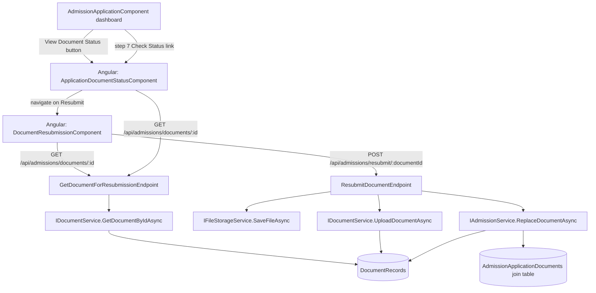
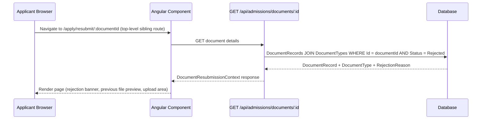
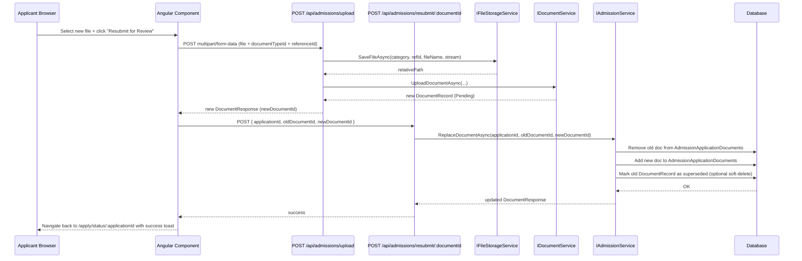
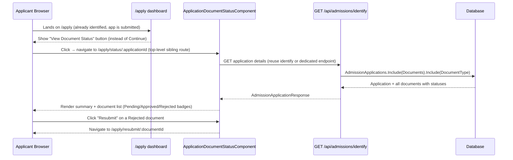

# Design Document: Document Resubmission

## Overview

When an applicant's document is rejected during the admissions review process, they need a dedicated page to resubmit that specific document without restarting their entire application. This feature provides a focused resubmission flow: the applicant sees the rejection reason, previews their previously rejected file, uploads a replacement, and submits it for re-review. The new document record replaces the old one in the application's document collection and resets to Pending status.

The feature integrates with the existing FastEndpoints backend (ASP.NET Core) and Angular 17 standalone component frontend, reusing the existing `IDocumentService`, `IFileStorageService`, and `AdmissionService` patterns already established in the codebase.

## Architecture



## Sequence Diagrams

### Load Resubmission Page



### Resubmit Document



### View Document Status Page



## Components and Interfaces

### Backend: GetDocumentForResubmissionEndpoint

**Route**: `GET /api/admissions/documents/:id/resubmission-context`

**Purpose**: Returns all context needed to render the resubmission page for a given rejected document.

**Interface**:

```csharp
// Request: documentId from route param
// Response:
public sealed record DocumentResubmissionContextResponse(
    Guid DocumentId,
    string FileName,
    string FileUrl,
    string DocumentTypeName,
    string DocumentTypeCode,
    string RejectionReason,
    DateTime UploadedAt,
    Guid ApplicationId,
    string ApplicantFullName   // computed: $"{FirstName} {MiddleName} {LastName}".Trim()
);
```

**Responsibilities**:

- Fetch `DocumentRecord` by Id, including `DocumentType` navigation
- Verify `Status == Rejected` (return 400 if not rejected)
- Resolve the `ApplicationId` by querying `AdmissionApplicationDocuments` join table
- Return the context response

---

### Backend: ResubmitDocumentEndpoint

**Route**: `POST /api/admissions/resubmit/:documentId`

**Purpose**: Atomically replaces the rejected document in the application with a newly uploaded one and resets status to Pending.

**Interface**:

```csharp
public sealed record ResubmitDocumentRequest(
    Guid ApplicationId,
    Guid NewDocumentId
);

// Response: DocumentResponse (existing contract)
```

**Responsibilities**:

- Validate old document exists and is Rejected
- Validate new document exists and is Pending
- Call `IAdmissionService.ReplaceDocumentAsync(applicationId, oldDocumentId, newDocumentId)`
- Return the new `DocumentResponse`

---

### Backend: IAdmissionService.ReplaceDocumentAsync

**Purpose**: Transactional swap of document in the application's document collection.

**Interface**:

```csharp
Task<DocumentRecord> ReplaceDocumentAsync(Guid applicationId, Guid oldDocumentId, Guid newDocumentId);
```

**Responsibilities**:

- Load `AdmissionApplication` with `Documents` collection
- Remove old `DocumentRecord` from `application.Documents`
- Add new `DocumentRecord` to `application.Documents`
- Save changes in a single `SaveChangesAsync` call

---

### Frontend: DocumentResubmissionComponent

**Route**: `/apply/resubmit/:documentId` (top-level sibling route in `app.routes.ts`, lazy-loaded)

**Purpose**: Standalone Angular component matching the UI mockup — shows rejection context, previous file preview, and new file upload.

**Interface**:

```typescript
interface ResubmissionContext {
  documentId: string;
  fileName: string;
  fileUrl: string;
  documentTypeName: string;
  rejectionReason: string;
  uploadedAt: string;
  applicationId: string;
  applicantFullName: string; // for display in page header
}
```

**Responsibilities**:

- Read `:documentId` from route params on init
- Call `AdmissionService.getDocumentResubmissionContext(documentId)`
- Render rejection reason banner, previous file preview panel, and upload area
- On file select: validate type (PDF/JPG/PNG) and size (≤ 10MB) client-side
- On submit: call `uploadDocument()` then `resubmitDocument(oldId, appId, newId)`
- On success: navigate to `/apply/status/:applicationId` with a query param `?resubmitted=true`
- On cancel: navigate back to `/apply/status/:applicationId`

---

### Frontend: ApplicationDocumentStatusComponent

**Route**: `/apply/status/:applicationId` (top-level sibling route in `app.routes.ts`, lazy-loaded)

**Purpose**: Dedicated status page showing all documents for a submitted application with per-document status badges and resubmit actions for rejected ones.

**Interface**:

```typescript
interface DocumentStatusItem {
  documentId: string;
  documentTypeName: string;
  fileName: string;
  fileUrl: string;
  status: "Pending" | "Approved" | "Rejected";
  rejectionReason?: string;
}

interface ApplicationStatusView {
  applicationId: string;
  applicantFullName: string; // FirstName + MiddleName + LastName
  programName: string;
  sessionName: string;
  overallStatus: string;
  documents: DocumentStatusItem[];
}
```

**Responsibilities**:

- Read `:applicationId` from route params on init
- Call `AdmissionService.identify(email, jamb)` or a dedicated `getApplicationById` endpoint to load the application with documents
- Render application summary header (name, program, session, overall status)
- For each document:
  - `Approved` → green checkmark badge
  - `Pending` → yellow "Under Review" badge
  - `Rejected` → red "Rejected" badge + "Resubmit" button linking to `/apply/resubmit/:documentId`
- Show success toast if `?resubmitted=true` query param is present on load

**Entry points**:

1. `/apply` dashboard — after identifying, if `app.status !== 'draft'`, show "View Document Status" button that navigates to `/apply/status/:applicationId`
2. Step 7 (Review) of `AdmissionApplicationComponent` — "Check Document Status" link navigating to `/apply/status/:applicationId`
3. After successful resubmission in `DocumentResubmissionComponent` — automatic redirect to `/apply/status/:applicationId?resubmitted=true`

## Data Models

### DocumentResubmissionContextResponse (new backend contract)

```csharp
public sealed record DocumentResubmissionContextResponse(
    Guid DocumentId,
    string FileName,
    string FileUrl,
    string DocumentTypeName,
    string DocumentTypeCode,
    string RejectionReason,
    DateTime UploadedAt,
    Guid ApplicationId,
    string ApplicantFullName   // computed: $"{FirstName} {MiddleName} {LastName}".Trim()
);
```

**Validation Rules**:

- `DocumentId` must reference an existing `DocumentRecord` with `Status == Rejected`
- `ApplicationId` must be resolvable from the `AdmissionApplicationDocuments` join table
- `RejectionReason` may be empty string but never null in the response

### ResubmitDocumentRequest (new backend contract)

```csharp
public sealed record ResubmitDocumentRequest(
    Guid ApplicationId,
    Guid NewDocumentId
);
```

**Validation Rules**:

- `ApplicationId` must reference an existing `AdmissionApplication`
- `NewDocumentId` must reference a `DocumentRecord` with `Status == Pending`
- The old document (from route param) must belong to the given `ApplicationId`

### AdmissionService additions (frontend)

```typescript
// New methods on AdmissionService
getDocumentResubmissionContext(documentId: string): Observable<DocumentResubmissionContextResponse>
resubmitDocument(oldDocumentId: string, applicationId: string, newDocumentId: string): Observable<DocumentResponse>
```

---

### AdmissionApplication entity (updated)

The `StudentName` single-string field is replaced by three separate fields:

```csharp
// Before (removed):
// public string StudentName { get; set; } = string.Empty;

// After:
public string FirstName { get; set; } = string.Empty;
public string? MiddleName { get; set; }          // optional
public string LastName { get; set; } = string.Empty;
```

**EF Core migration note**: The existing `StudentName` column must be split. Add a migration that:

1. Adds `FirstName` (nvarchar, not null), `MiddleName` (nvarchar, nullable), `LastName` (nvarchar, not null)
2. Populates `FirstName` from the first word of `StudentName` and `LastName` from the remainder (or a manual data-fix script)
3. Drops the `StudentName` column

---

### AdmissionApplicationResponse (updated contract)

```csharp
// Replace StudentName with three fields:
public sealed record AdmissionApplicationResponse(
    Guid Id,
    string ApplicationNumber,
    string StudentFirstName,    // replaces StudentName
    string? StudentMiddleName,
    string StudentLastName,
    string StudentEmail,
    // ... all other existing fields unchanged
);
```

---

### SaveApplicationRequest (updated contract)

```csharp
public sealed record SaveApplicationRequest(
    Guid? Id,
    string StudentFirstName,    // replaces StudentName
    string? StudentMiddleName,
    string StudentLastName,
    string StudentEmail,
    string JambRegNumber,
    // ... all other existing fields unchanged
);
```

---

### AdmissionApplicationData (frontend model, updated)

```typescript
// In admission-data.ts — replace studentName with three fields:
export interface AdmissionApplicationData {
  // ...
  studentFirstName: string; // replaces studentName
  studentMiddleName?: string;
  studentLastName: string;
  // ...
}
```

Step 1 (Persona/Contact) of the application form gains three separate input fields:

- "First Name" (required)
- "Middle Name" (optional)
- "Last Name" (required)

The `AdmissionApplicationComponent.freshApp()` initialises all three to `''`.

---

### AdmissionService.SubmitApplicationAsync — email call (updated)

```csharp
// Before:
await emailService.SendApplicationSubmittedEmailAsync(app.StudentEmail, app.StudentName);

// After:
var fullName = $"{app.FirstName} {app.LastName}".Trim();
await emailService.SendApplicationSubmittedEmailAsync(app.StudentEmail, fullName);
```

All other `app.StudentName` references in `HandleStatusChangeNotificationsAsync` follow the same pattern: `$"{app.FirstName} {app.LastName}"`.

---

### AutoAdmitResult record (updated)

```csharp
// Before:
public record AutoAdmitResult(Guid ApplicationId, string StudentName, ...);

// After:
public record AutoAdmitResult(Guid ApplicationId, string StudentFullName, ...);
// Populated as: $"{app.FirstName} {app.LastName}"
```

## Algorithmic Pseudocode

### ResubmitDocumentEndpoint.HandleAsync

```pascal
PROCEDURE HandleAsync(req: ResubmitDocumentRequest, oldDocumentId: Guid)
  INPUT: req.ApplicationId, req.NewDocumentId, oldDocumentId (route param)
  OUTPUT: ApiResponse<DocumentResponse>

  BEGIN
    oldDoc ← documentService.GetDocumentByIdAsync(oldDocumentId)
    IF oldDoc IS NULL THEN
      RETURN 404 "Document not found"
    END IF

    IF oldDoc.Status ≠ Rejected THEN
      RETURN 400 "Document is not in Rejected status"
    END IF

    newDoc ← documentService.GetDocumentByIdAsync(req.NewDocumentId)
    IF newDoc IS NULL THEN
      RETURN 404 "New document not found"
    END IF

    result ← admissionService.ReplaceDocumentAsync(req.ApplicationId, oldDocumentId, req.NewDocumentId)

    RETURN 200 DocumentResponse(result)
  END
END PROCEDURE
```

**Preconditions**:

- `oldDocumentId` is a valid GUID referencing an existing `DocumentRecord`
- `oldDoc.Status == Rejected`
- `req.NewDocumentId` references a `DocumentRecord` with `Status == Pending`
- `req.ApplicationId` references an existing `AdmissionApplication` that contains `oldDocumentId`

**Postconditions**:

- `AdmissionApplicationDocuments` no longer contains `oldDocumentId` for `ApplicationId`
- `AdmissionApplicationDocuments` now contains `newDocumentId` for `ApplicationId`
- Returned `DocumentResponse` reflects the new document with `Status = Pending`

---

### IAdmissionService.ReplaceDocumentAsync

```pascal
PROCEDURE ReplaceDocumentAsync(applicationId: Guid, oldDocumentId: Guid, newDocumentId: Guid)
  INPUT: applicationId, oldDocumentId, newDocumentId
  OUTPUT: DocumentRecord (the new record)

  BEGIN
    // IQueryable<T> — use async EF Core method
    application ← AWAIT dbContext.AdmissionApplications
                    .Include(Documents)
                    .FirstOrDefaultAsync(a => a.Id = applicationId)

    IF application IS NULL THEN
      THROW KeyNotFoundException("Application not found")
    END IF

    // application.Documents is ICollection<DocumentRecord> (in-memory after .Include())
    // Use synchronous LINQ with explicit type argument — NOT FirstOrDefaultAsync
    oldDoc ← application.Documents.FirstOrDefault<DocumentRecord>(d => d.Id = oldDocumentId)
    IF oldDoc IS NULL THEN
      THROW KeyNotFoundException("Old document not linked to this application")
    END IF

    // IQueryable<T> — use async EF Core method
    newDoc ← AWAIT dbContext.DocumentRecords
               .Include(DocumentType)
               .FirstOrDefaultAsync(d => d.Id = newDocumentId)

    IF newDoc IS NULL THEN
      THROW KeyNotFoundException("New document not found")
    END IF

    application.Documents.Remove(oldDoc)
    application.Documents.Add(newDoc)
    application.UpdatedAt ← DateTime.UtcNow

    AWAIT dbContext.SaveChangesAsync()

    RETURN newDoc
  END
END PROCEDURE
```

> **LINQ vs EF Core async rule**: `FirstOrDefaultAsync` is only valid on `IQueryable<T>` (i.e., `dbContext.SomeSet.Where(...)`). After `.Include()` materialises the collection, `application.Documents` is an `ICollection<DocumentRecord>` — call synchronous `.FirstOrDefault<DocumentRecord>(...)` with the explicit type argument to avoid CS type-inference errors.

**Loop Invariants**: N/A (no loops; single atomic EF Core transaction)

---

### Frontend: DocumentResubmissionComponent.onSubmit

```pascal
PROCEDURE onSubmit()
  INPUT: selectedFile (File), context (ResubmissionContext)
  OUTPUT: navigation to /apply OR error state

  BEGIN
    IF selectedFile IS NULL THEN
      RETURN (show validation error)
    END IF

    IF selectedFile.size > 10_485_760 THEN
      RETURN (show "File exceeds 10MB" error)
    END IF

    IF selectedFile.type NOT IN [pdf, jpeg, png] THEN
      RETURN (show "Invalid file type" error)
    END IF

    isSubmitting ← true

    uploadResult ← admissionService.uploadDocument(
      context.documentTypeId, selectedFile, context.applicationId
    )

    newDocumentId ← uploadResult.documents[0].id

    admissionService.resubmitDocument(
      context.documentId, context.applicationId, newDocumentId
    )

    isSubmitting ← false
    router.navigate(['/apply/status', context.applicationId], { queryParams: { resubmitted: true } })
  END

  ON ERROR:
    isSubmitting ← false
    errorMessage ← "Resubmission failed. Please try again."
  END
END PROCEDURE
```

## Key Functions with Formal Specifications

### GetDocumentForResubmissionEndpoint.HandleAsync

```csharp
Task HandleAsync(EmptyRequest req, CancellationToken ct)
// Route param: Guid id
```

**Preconditions**:

- `id` is a valid GUID present in `DocumentRecords`
- The document's `Status == Rejected`
- The document is linked to exactly one `AdmissionApplication` via the join table

**Postconditions**:

- Returns `DocumentResubmissionContextResponse` with all fields populated
- `ApplicationId` is the Id of the application that owns this document
- If document not found: returns 404
- If document not rejected: returns 400 with descriptive message

---

### ResubmitDocumentEndpoint.HandleAsync

```csharp
Task HandleAsync(ResubmitDocumentRequest req, CancellationToken ct)
// Route param: Guid documentId (the old/rejected document)
```

**Preconditions**:

- `documentId` (route) references a `Rejected` `DocumentRecord`
- `req.NewDocumentId` references a `Pending` `DocumentRecord`
- `req.ApplicationId` references an `AdmissionApplication` containing `documentId`

**Postconditions**:

- Old document removed from application's `Documents` collection
- New document added to application's `Documents` collection
- `application.UpdatedAt` is refreshed
- Returns new `DocumentResponse` with `Status = "Pending"`

---

### AdmissionService.getDocumentResubmissionContext (frontend)

```typescript
getDocumentResubmissionContext(documentId: string): Observable<DocumentResubmissionContextResponse>
```

**Preconditions**: `documentId` is a non-empty string UUID

**Postconditions**:

- Returns observable that emits `DocumentResubmissionContextResponse` on success
- Emits HTTP error on 404 (document not found) or 400 (not rejected)

---

### AdmissionService.resubmitDocument (frontend)

```typescript
resubmitDocument(oldDocumentId: string, applicationId: string, newDocumentId: string): Observable<DocumentResponse>
```

**Preconditions**: All three IDs are non-empty string UUIDs

**Postconditions**:

- On success: emits `DocumentResponse` for the new document with `status = "Pending"`
- On error: emits HTTP error observable

## Example Usage

### Navigation Flow

```
/apply (dashboard)
  → identify applicant
  → if app.status !== 'draft': show "View Document Status" button
  → /apply/status/:applicationId          ← top-level sibling route
      → document list with status badges
      → "Resubmit" button on Rejected doc
      → /apply/resubmit/:documentId       ← top-level sibling route
          → upload new file + submit
          → on success → /apply/status/:applicationId?resubmitted=true
```

Step 7 (Review) of the application form also shows a "Check Document Status" link:

```typescript
// Dashboard: show "View Document Status" for submitted apps
// [routerLink]="['/apply/status', app.id]"

// Step 7 review: "Check Document Status" link
// [routerLink]="['/apply/status', app.id]"
```

### Navigating to the Resubmission Page (from status page)

```typescript
// ApplicationDocumentStatusComponent — "Resubmit" button per rejected doc
// [routerLink]="['/apply/resubmit', doc.documentId]"
```

### Backend: Fetching Resubmission Context

```http
GET /api/admissions/documents/3fa85f64-5717-4562-b3fc-2c963f66afa6/resubmission-context

Response 200:
{
  "success": true,
  "data": {
    "documentId": "3fa85f64-5717-4562-b3fc-2c963f66afa6",
    "fileName": "birth_certificate.pdf",
    "fileUrl": "/uploads/Admission/app-123/birth_certificate.pdf",
    "documentTypeName": "Birth Certificate",
    "documentTypeCode": "BIRTH_CERT",
    "rejectionReason": "Document is blurry and unreadable",
    "uploadedAt": "2025-01-10T14:30:00Z",
    "applicationId": "a1b2c3d4-e5f6-7890-abcd-ef1234567890"
  }
}
```

### Backend: Resubmitting

```http
POST /api/admissions/resubmit/3fa85f64-5717-4562-b3fc-2c963f66afa6
Content-Type: application/json

{
  "applicationId": "a1b2c3d4-e5f6-7890-abcd-ef1234567890",
  "newDocumentId": "9c8b7a65-4321-fedc-ba09-876543210fed"
}

Response 200:
{
  "success": true,
  "data": {
    "id": "9c8b7a65-4321-fedc-ba09-876543210fed",
    "fileName": "birth_certificate_v2.pdf",
    "status": "Pending",
    "rejectionReason": null,
    ...
  }
}
```

### Frontend: Component Init

```typescript
// DocumentResubmissionComponent
ngOnInit() {
  const documentId = this.route.snapshot.paramMap.get('documentId')!;
  this.admissionService.getDocumentResubmissionContext(documentId).subscribe({
    next: (ctx) => this.context.set(ctx),
    error: () => this.router.navigate(['/apply'])
  });
}

// On successful resubmission:
// this.router.navigate(['/apply/status', this.context().applicationId], { queryParams: { resubmitted: true } });
```

### ApplicationDocumentStatusComponent Init

```typescript
// ApplicationDocumentStatusComponent
ngOnInit() {
  const applicationId = this.route.snapshot.paramMap.get('applicationId')!;
  // Load application with documents via existing identify endpoint or dedicated GET
  this.admissionService.getApplicationById(applicationId).subscribe({
    next: (app) => this.statusView.set(this.mapToStatusView(app)),
    error: () => this.router.navigate(['/apply'])
  });

  // Show success toast if redirected from resubmission
  if (this.route.snapshot.queryParamMap.get('resubmitted') === 'true') {
    this.showToast('Document resubmitted successfully. It is now under review.');
  }
}
```

## Correctness Properties

1. **Idempotency of replacement**: For any application `A` and rejected document `D`, after `ReplaceDocumentAsync(A.Id, D.Id, N.Id)` completes, `A.Documents` contains `N` and does not contain `D`. Calling it again with the same `D` returns 404 (D is no longer linked).

2. **Status invariant**: After a successful resubmission, the new `DocumentRecord.Status == Pending`. The old document's status is unchanged (still `Rejected`) but it is no longer linked to the application.

3. **Document type preservation**: The new document uploaded during resubmission must have the same `DocumentTypeId` as the old rejected document. The `uploadDocument` call passes the same `documentTypeId` from the context.

4. **File constraint enforcement**: The frontend rejects any file where `size > 10_485_760` bytes or `type ∉ {application/pdf, image/jpeg, image/png}` before any network call is made.

5. **Single application ownership**: A rejected document belongs to exactly one application. `GetDocumentForResubmissionEndpoint` returns 404 if no application link is found, preventing orphaned resubmissions.

6. **No double-resubmission**: Once a document is replaced, it is removed from the application. A second attempt to resubmit the same `oldDocumentId` will fail with 404 at the `ReplaceDocumentAsync` step.

## Error Handling

### Document Not Found (404)

**Condition**: `documentId` route param does not match any `DocumentRecord`
**Response**: `404 { "errorCode": "not_found", "message": "Document not found" }`
**Recovery**: Frontend redirects to `/apply`

### Document Not Rejected (400)

**Condition**: Document exists but `Status != Rejected`
**Response**: `400 { "errorCode": "invalid_state", "message": "Document is not in Rejected status" }`
**Recovery**: Frontend shows error toast and redirects to `/apply`

### Application Not Found (404)

**Condition**: `applicationId` in request body does not match any `AdmissionApplication`
**Response**: `404 { "errorCode": "not_found", "message": "Application not found" }`
**Recovery**: Frontend shows error message

### File Validation Failure (client-side)

**Condition**: File type not PDF/JPG/PNG or size > 10MB
**Response**: Inline validation error shown in upload area
**Recovery**: User selects a different file; no network call made

### Upload Failure (500/network)

**Condition**: `POST /api/admissions/upload` fails
**Response**: Error message shown below upload area
**Recovery**: User can retry; resubmit button re-enabled

## Testing Strategy

### Unit Testing Approach

- `ResubmitDocumentEndpoint`: Test with mocked `IDocumentService` and `IAdmissionService` — verify 404 on missing doc, 400 on non-rejected doc, 200 on valid swap
- `AdmissionService.ReplaceDocumentAsync`: Test with in-memory EF Core — verify join table rows are correctly removed/added in a single transaction
- `DocumentResubmissionComponent`: Test with Angular TestBed — verify context loads on init, file validation logic, submit flow calls correct service methods in order

### Property-Based Testing Approach

**Property Test Library**: fast-check (frontend), or xUnit with FsCheck (backend)

- For any `documentId` where `Status == Rejected` and linked to application `A`, `ReplaceDocumentAsync` always results in `A.Documents` containing exactly one document of that `DocumentTypeId` with `Status == Pending`
- File size validation: for any file with `size > 10_485_760`, `onSubmit()` never calls `uploadDocument()`

### Integration Testing Approach

- End-to-end: seed a `Rejected` document linked to an application, call `GET resubmission-context`, upload a new file, call `POST resubmit`, verify the join table state and new document status via `GET identify`

## Security Considerations

- The resubmission endpoints are currently `AllowAnonymous` consistent with the rest of the admission flow (applicants are not authenticated users in the system). This is acceptable for the admission portal pattern already established.
- The `applicationId` in the resubmit request is validated server-side to ensure the old document actually belongs to that application, preventing cross-application document swaps.
- File uploads are handled by the existing `IFileStorageService` which controls storage paths — no user-controlled path traversal is possible.
- File type validation should be enforced server-side (MIME type check) in addition to the client-side check, reusing the existing upload endpoint's behavior.

## Dependencies

- **Existing**: `IDocumentService`, `IFileStorageService`, `IAdmissionService`, `LmsDbContext`, `ApiEndpoint<TRequest, TResponse>` base class, `DocumentResponse` contract, `AdmissionService` (Angular), `AdmissionApplicationComponent` (for navigation entry points)
- **New backend contracts**: `DocumentResubmissionContextResponse` (updated with `ApplicantFullName`), `ResubmitDocumentRequest`
- **New backend endpoints**: `GetDocumentForResubmissionEndpoint`, `ResubmitDocumentEndpoint`
- **New service method**: `IAdmissionService.ReplaceDocumentAsync` + implementation in `AdmissionService`
- **New frontend components**: `DocumentResubmissionComponent` (standalone), `ApplicationDocumentStatusComponent` (standalone)
- **New routes**: `/apply/status/:applicationId` and `/apply/resubmit/:documentId` — both top-level sibling routes alongside `/apply` in `app.routes.ts`, lazy-loaded
- **New frontend service methods**: `getDocumentResubmissionContext`, `resubmitDocument`, `getApplicationById` on `AdmissionService`
- **Entity change**: `AdmissionApplication.StudentName` → `FirstName`, `MiddleName`, `LastName` (EF Core migration required)
- **Contract changes**: `AdmissionApplicationResponse`, `SaveApplicationRequest` updated with split name fields; `AutoAdmitResult.StudentName` → `StudentFullName`
