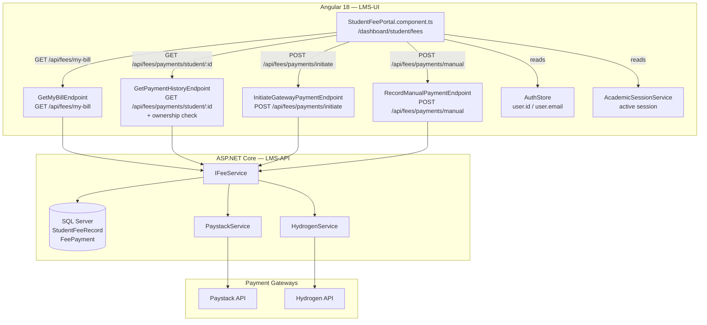

# Design Document — Student Fee Payment Portal

## Overview

The Student Fee Payment Portal adds a student-facing self-service fee view to the Wigwe University LMS. It consists of two thin backend additions (a student-scoped bill endpoint and ownership guards on existing endpoints) plus a new Angular standalone component at `/dashboard/student/fees`.

The backend is already feature-complete for the admin/finance side. This feature reuses `IFeeService`, `StudentFeeRecord`, `FeePayment`, `PaystackService`, and `HydrogenService` without modification. The only new backend work is one new FastEndpoints endpoint and two ownership-check guards added to existing endpoints.

The frontend component fetches the student's bill and payment history on load, handles gateway redirect callbacks on `ngOnInit`, and provides Paystack, Hydrogen, and manual-receipt payment flows — all within the established dark theme.

---

## Architecture



**Data flow for gateway payment:**

1. Component calls `POST /api/fees/payments/initiate` → receives `checkoutUrl`
2. Browser redirects to gateway checkout page
3. Gateway redirects back to `/dashboard/student/fees?reference=...` (or `tx_ref=...`)
4. Component `ngOnInit` detects callback params, shows toast, cleans URL, reloads data after 3 s
5. Webhook (already implemented) confirms payment asynchronously and updates `StudentFeeRecord`

---

## Components and Interfaces

### Backend — New Endpoint

**`GetMyBillEndpoint`** — `GET /api/fees/my-bill?sessionId={sessionId}`

- Inherits `ApiEndpointWithoutRequest<StudentBillResponse>`
- Requires `Student` role
- Resolves `studentId` from `context.Items["CurrentUserId"]` (set by `UserProvisioningMiddleware`)
- If `sessionId` query param is absent, queries `AcademicSessions` for the active session
- Delegates to existing `IFeeService.GetStudentBillAsync(studentId, sessionId)`
- Returns 400 if no active session and no `sessionId` provided
- Returns 404 if no bill found

### Backend — Ownership Guards on Existing Endpoints

**`GetStudentBillEndpoint`** (`GET /api/fees/bill/{studentId}/{sessionId}`)

Add an ownership check: if the caller has only the `Student` role (not Admin/Finance/SuperAdmin/Registry), verify that the route `studentId` matches `context.Items["CurrentUserId"]`. Return 403 if not.

**`GetPaymentHistoryEndpoint`** (`GET /api/fees/payments/student/{studentId}`)

Same ownership check pattern.

### Frontend — `StudentFeePortal.component.ts`

Standalone Angular component, inline template, no separate HTML file.

**Signals:**
| Signal | Type | Purpose |
|---|---|---|
| `bill` | `StudentBill \| null` | Current session bill |
| `payments` | `FeePayment[]` | Payment history |
| `loading` | `boolean` | Bill/history fetch in progress |
| `paying` | `boolean` | Gateway/manual request in progress |
| `toast` | `{message, type} \| null` | Active toast notification |
| `selectedFile` | `File \| null` | Manual receipt file |
| `manualRef` | `string` | Bank reference number input |
| `activeSession` | `AcademicSession \| null` | Resolved active session |

**Injected services:** `FeeService`, `AuthStore`, `AcademicSessionService`, `Router`, `ActivatedRoute`

**Key methods:**

- `ngOnInit()` — resolves session, fetches bill + history, handles callback params
- `handleCallbackParams()` — reads query params, shows toast, cleans URL, schedules reload
- `payWithPaystack()` — calls initiate endpoint, redirects
- `payWithHydrogen()` — calls initiate endpoint, redirects
- `submitManualPayment()` — validates inputs, builds FormData, calls manual endpoint
- `showToast(message, type)` — sets toast signal, auto-clears after 4 s
- `loadData()` — parallel fetch of bill and payment history

### Frontend — Route

Already registered in `app.routes.ts`:

```typescript
{ path: 'student/fees', loadComponent: () => import('./components/Dashboard/Student/Fees/StudentFees.component').then(m => m.StudentFeesComponent) }
```

The component file will be created at `LMS-UI/src/app/components/Dashboard/Student/Fees/StudentFeePortal.component.ts` and exported as `StudentFeesComponent` to match the existing route import.

---

## Data Models

All data models are already defined. The component consumes the existing `FeeService` interfaces:

```typescript
// Already in fee.service.ts — used as-is
interface StudentBill {
  id: string;
  studentId: string;
  sessionId: string;
  sessionName: string;
  totalAmount: number;
  amountPaid: number;
  balance: number;
  lateFeeApplied: boolean;
  lateFeeTotal: number;
  status: string; // 'Outstanding' | 'PartiallyPaid' | 'Paid' | 'Waived'
  generatedAt: string;
  payments: FeePayment[];
  lateFeeApplications: LateFeeApplication[];
}

interface FeePayment {
  id: string;
  amount: number;
  paymentMethod: string; // 'Manual' | 'Paystack' | 'Hydrogen'
  referenceNumber?: string;
  receiptUrl?: string;
  gatewayReference?: string;
  status: string; // 'Pending' | 'Confirmed' | 'Rejected' | 'Failed'
  rejectionReason?: string;
  paidAt: string;
  confirmedAt?: string;
  confirmedBy?: string;
}
```

**New method added to `FeeService`:**

```typescript
getMyBill(sessionId?: string): Observable<StudentBill> {
  const url = sessionId
    ? `${this.apiUrl}/my-bill?sessionId=${sessionId}`
    : `${this.apiUrl}/my-bill`;
  return this.http.get<ApiResponse<StudentBill>>(url).pipe(map(res => res.data));
}
```

**Backend — `GetMyBillRequest`** (query param model):

```csharp
public sealed record GetMyBillRequest(Guid? SessionId = null);
```

---

## Correctness Properties

_A property is a characteristic or behavior that should hold true across all valid executions of a system — essentially, a formal statement about what the system should do. Properties serve as the bridge between human-readable specifications and machine-verifiable correctness guarantees._

### Property 1: Bill fields are always rendered

_For any_ valid `StudentBill` object, the rendered portal template should contain the session name, total amount, amount paid, and outstanding balance.

**Validates: Requirements 1.2, 10.2**

---

### Property 2: Terminal bill statuses hide payment actions

_For any_ bill whose `status` is `Paid` or `Waived`, the payment action buttons (Paystack, Hydrogen, manual submit) should not be present in the rendered DOM.

**Validates: Requirements 1.3, 1.4**

---

### Property 3: Late fee banner appears when applied

_For any_ bill where `lateFeeApplied === true`, the rendered template should contain a late-fee warning element displaying the `lateFeeTotal` value.

**Validates: Requirements 1.5**

---

### Property 4: All payment records are rendered with required fields

_For any_ non-empty list of `FeePayment` records, the rendered payment history table should contain one row per payment, and each row should include the `paidAt` date, `paymentMethod`, `amount`, and `status`.

**Validates: Requirements 2.1, 2.2**

---

### Property 5: Rejected payments display rejection reason

_For any_ `FeePayment` with `status === 'Rejected'`, the rendered row should contain the `rejectionReason` text.

**Validates: Requirements 2.3**

---

### Property 6: In-flight state disables all payment controls

_For any_ component state where a payment request is in-flight (`paying === true`), all payment buttons (Paystack, Hydrogen, manual submit) should have the `disabled` attribute set.

**Validates: Requirements 3.3, 4.3, 5.8, 9.7**

---

### Property 7: Manual payment form requires both file and reference

_For any_ submission attempt where either the receipt file is absent or the reference number is empty (or whitespace-only), the `POST /api/fees/payments/manual` call should not be made and the form should remain in its current state.

**Validates: Requirements 5.4**

---

### Property 8: Zero-balance hides manual upload section

_For any_ bill where `balance === 0`, the manual payment upload section should not be present in the rendered DOM.

**Validates: Requirements 5.9**

---

### Property 9: Gateway callback parameters are correctly classified

_For any_ URL query string, if it contains `reference` or `trxref`, the callback should be classified as Paystack; if it contains `tx_ref` or `transactionRef`, it should be classified as Hydrogen. These classifications must be mutually exclusive for non-overlapping parameter sets.

**Validates: Requirements 6.2, 6.3**

---

### Property 10: Student ownership — cross-student access is always forbidden

_For any_ authenticated student making a request to `GET /api/fees/bill/{studentId}/{sessionId}` or `GET /api/fees/payments/student/{studentId}` where the route `studentId` does not match the caller's own identity, the response status should be 403 Forbidden.

**Validates: Requirements 7.2, 7.5**

---

### Property 11: My-bill endpoint returns the caller's own bill

_For any_ authenticated student calling `GET /api/fees/my-bill`, the `studentId` field in the returned `StudentBillResponse` should equal the caller's own identity (resolved from JWT claims), never another student's ID.

**Validates: Requirements 8.2**

---

### Property 12: Balance equals total minus paid

_For any_ `StudentBill` returned by the API, `balance` should equal `totalAmount − amountPaid`. This invariant must hold regardless of how many payments have been applied.

**Validates: Requirements 1.2, 10.1, 10.3**

---

## Error Handling

| Scenario                                            | Backend response    | Frontend behaviour                                                 |
| --------------------------------------------------- | ------------------- | ------------------------------------------------------------------ |
| Bill not found (no bill generated)                  | 404                 | Informational message: "Your fee bill has not been generated yet." |
| No active session                                   | 400 from `/my-bill` | Informational message: "No active academic session found."         |
| Cross-student access                                | 403                 | Error toast (generic auth error)                                   |
| Gateway initiation failure                          | 4xx/5xx             | Error toast with gateway name, buttons re-enabled                  |
| Manual payment submission failure                   | 4xx/5xx             | Error toast, submit button re-enabled                              |
| Bill/history network error                          | Network error       | Error toast: "Failed to load…"                                     |
| Callback with `status=cancelled` or `status=failed` | N/A (client-side)   | Error toast: "Payment was not completed."                          |

All backend errors follow the existing `ApiResponse<T>` envelope with `success: false`, `statusCode`, and `message` fields. The frontend reads `error.error?.message` for user-facing error text.

---

## Testing Strategy

### Unit Tests (Angular — Jasmine/Karma or Jest)

Focus on specific examples and edge cases:

- Component initialises and calls `getMyBill()` and `getPaymentHistory()` on load
- Callback params `reference`/`trxref` trigger Paystack success toast
- Callback params `tx_ref`/`transactionRef` trigger Hydrogen success toast
- `status=cancelled` callback triggers error toast
- URL is cleaned after callback processing (`window.history.replaceState` called)
- Manual submit with no file selected does not call the API
- Manual submit with empty reference does not call the API
- Toast auto-dismisses after 4 seconds

Focus on specific examples and integration points:

- `GetMyBillEndpoint` returns 400 when no active session and no `sessionId` param
- `GetMyBillEndpoint` returns 404 when bill does not exist
- `GetStudentBillEndpoint` returns 403 when student requests another student's bill
- `GetPaymentHistoryEndpoint` returns 403 when student requests another student's history

### Property-Based Tests

Use **fast-check** (TypeScript/Angular) for frontend properties and **FsCheck** (C#) for backend properties. Each test runs a minimum of 100 iterations.

**Frontend property tests (fast-check):**

```
// Feature: student-fee-payment-portal, Property 1: Bill fields are always rendered
fc.property(fc.record({ sessionName: fc.string(), totalAmount: fc.float(), amountPaid: fc.float(), balance: fc.float() }), ...)

// Feature: student-fee-payment-portal, Property 2: Terminal bill statuses hide payment actions
fc.property(fc.constantFrom('Paid', 'Waived'), ...)

// Feature: student-fee-payment-portal, Property 3: Late fee banner appears when applied
fc.property(fc.record({ lateFeeApplied: fc.constant(true), lateFeeTotal: fc.float({ min: 0.01 }) }), ...)

// Feature: student-fee-payment-portal, Property 4: All payment records rendered with required fields
fc.property(fc.array(paymentArbitrary, { minLength: 1 }), ...)

// Feature: student-fee-payment-portal, Property 5: Rejected payments display rejection reason
fc.property(fc.record({ status: fc.constant('Rejected'), rejectionReason: fc.string({ minLength: 1 }) }), ...)

// Feature: student-fee-payment-portal, Property 6: In-flight state disables all payment controls
fc.property(fc.constant(true) /* paying=true */, ...)

// Feature: student-fee-payment-portal, Property 7: Manual payment form requires both file and reference
fc.property(fc.oneof(fc.constant(null), fc.constant('')), ...)

// Feature: student-fee-payment-portal, Property 8: Zero-balance hides manual upload section
fc.property(fc.record({ balance: fc.constant(0) }), ...)

// Feature: student-fee-payment-portal, Property 9: Gateway callback parameters are correctly classified
fc.property(fc.oneof(fc.record({ reference: fc.string() }), fc.record({ tx_ref: fc.string() })), ...)
```

**Backend property tests (FsCheck / xUnit):**

```
// Feature: student-fee-payment-portal, Property 10: Student ownership — cross-student access is always forbidden
// For any two distinct student GUIDs, requesting one's bill as the other returns 403

// Feature: student-fee-payment-portal, Property 11: My-bill endpoint returns the caller's own bill
// For any authenticated student, the returned bill's studentId matches the JWT subject

// Feature: student-fee-payment-portal, Property 12: Balance equals total minus paid
// For any StudentFeeRecord, balance == totalAmount - amountPaid
```

Each property-based test must reference its design property via a comment tag:
`// Feature: student-fee-payment-portal, Property {N}: {property_text}`
